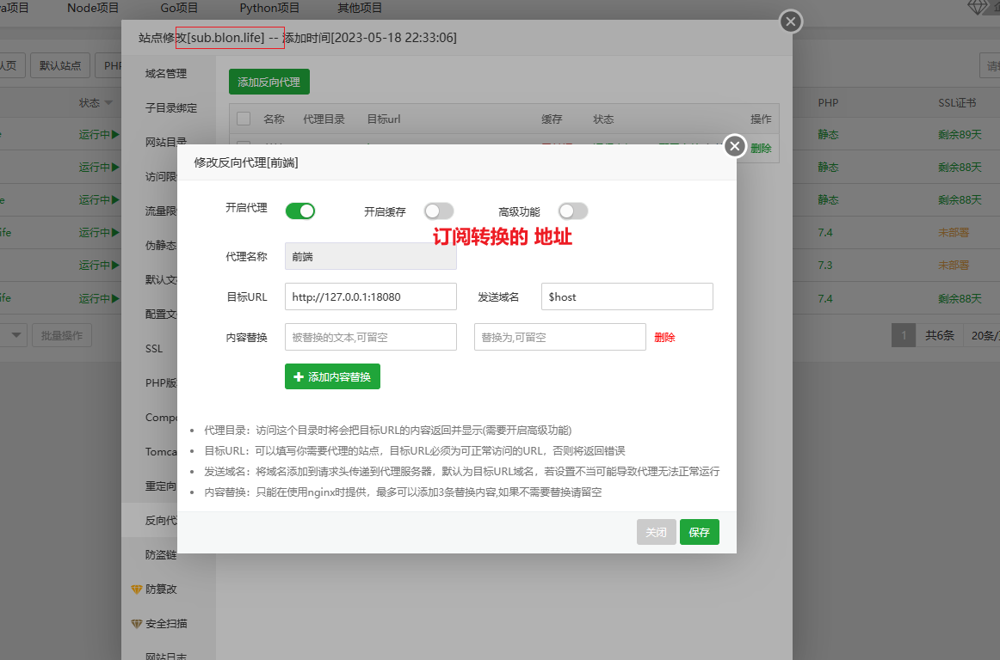
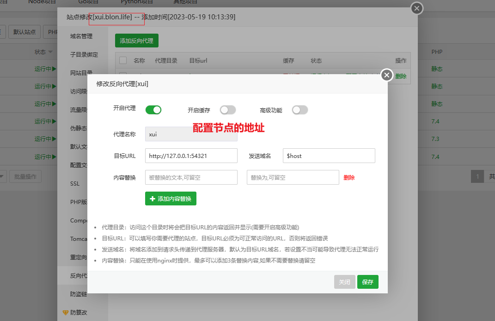
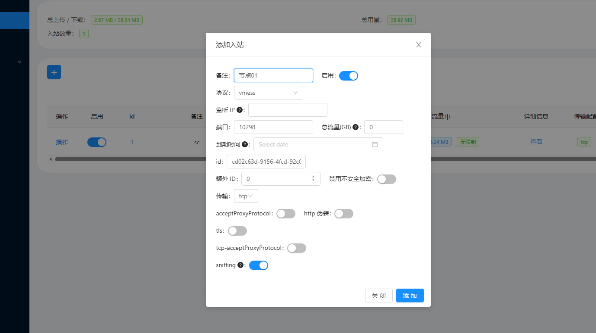
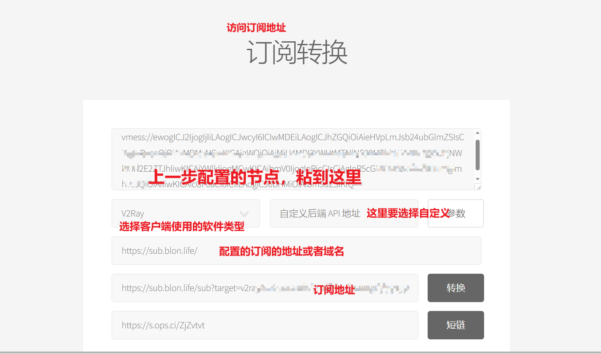

## 搭建clash 订阅

---

部署基于[stilleshan/dockerfiles/tree/main/sub](https://github.com/stilleshan/dockerfiles/tree/main/sub)修改的，添加了`x-ui`

### 操作步骤

1. 安装docker 

   ```
   curl -fsSL https://get.docker.com | sh
   ```

   

2. 下载拷贝目录至服务器,然后再服务器该根目录下执行

   ```
   docker-compose up -d
   ```

配置反向代理






### 相关设置

#### 节点配置 

登录节点的地址， 默认账号admin ，密码是 admin 



### 订阅转换

拷贝上一步生成的节点去生成订阅转换 




我只是对资源进行了整合，非常感谢相关源码作者付出

## 参考

- [stilleshan/dockerfiles/tree/main/sub](https://github.com/stilleshan/dockerfiles/tree/main/sub)
- [stilleshan/subweb](https://github.com/stilleshan/subweb)
- [stilleshan/subconverter]([dockerfiles/sub at main · stilleshan/dockerfiles · GitHub](https://github.com/stilleshan/dockerfiles/tree/main/sub))
- [vaxilu](https://github.com/vaxilu)
